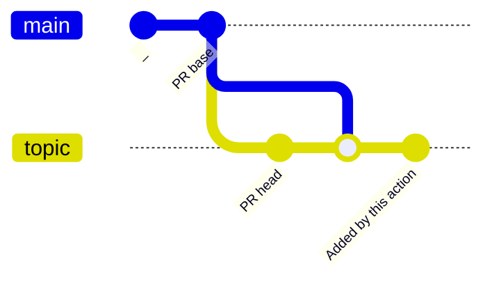
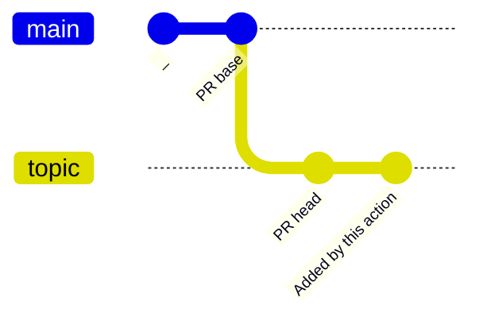

# update-generated-files-action [](https://github.com/int128/update-generated-files-action/actions/workflows/ts.yaml)

This is an action to push a commit to update generated files, such as Prettier, gofmt, OpenAPI Generator or GraphQL Code Generator.

## Getting Started

Here is an example workflow.

```yaml
on:
  pull_request:
  push:
    branches:
      - main

jobs:
  generate:
    runs-on: ubuntu-latest
    steps:
      - uses: actions/checkout@v3

      # something to generate files
      - run: yarn graphql-codegen

      # push the change if exists
      - uses: int128/update-generated-files-action@v2
```

### On `pull_request` event

When the workflow is run on `pull_request` event, this action pushes the change into the head branch of the current pull request.
If there is no change in the current directory, this action does nothing.

For example, this pull request is created but it contains any change,


This action adds the following commits into the pull request:


### On other events

When the workflow is run on other events such as `push` or `schedule`, this action creates a new pull request with the change.
If there is no change in the current directory, this action does nothing.

For example, there is any change on `main` branch,


This action creates the following pull request:


You can change the title or body of pull request.

```yaml
      - uses: int128/update-generated-files-action@v2
        with:
          title: Regenerate graphql code
          body: Updated by `yarn graphql-codegen`
```

## Notes

### Working with Renovate

You can update both dependencies and generated files as follows:

1. Renovate creates a pull request to update a dependency
1. GitHub Actions triggers a workflow
1. This action pushes a change if it exists
1. GitHub Actions triggers a workflow against the new commit

If the generated files are inconsistent, automerge will be prevented due to the failure of this action.

### Triggering GitHub Actions

This action uses the default token by default, but [it does not trigger a workflow](https://docs.github.com/en/actions/using-workflows/triggering-a-workflow#triggering-a-workflow-from-a-workflow) for the new commit.
You can reopen a pull request to trigger a workflow.

To trigger a workflow on the new commit, you need to set a personal access token or GitHub App token.

```yaml
      - uses: int128/update-generated-files-action@v2
        with:
          token: ${{ secrets.YOUR_PERSONAL_ACCESS_TOKEN }}
```

### Merge commit or Head commit

By default `actions/checkout` checks out [the merge branch](https://docs.github.com/en/actions/using-workflows/events-that-trigger-workflows#pull_request), this action adds a commit onto the merge commit.

Here is a diagram of the commit graph.



If you don't want to add the merge commit, set the head branch to `actions/checkout` as follows:

```yaml
jobs:
  generate:
    runs-on: ubuntu-latest
    steps:
      - uses: actions/checkout@v3
        with:
          ref: ${{ github.head_ref }}

      # something to generate files
      - run: yarn format

      - uses: int128/update-generated-files-action@v2
```

Here is a diagram of the commit graph if the head branch is checked out.



## Specification

### Inputs

| Name | Default | Description
|------|----------|------------
| `title` | see action.yaml | Title of pull request
| `body` | see action.yaml | Body of pull request
| `token` | `github.token` | GitHub token
