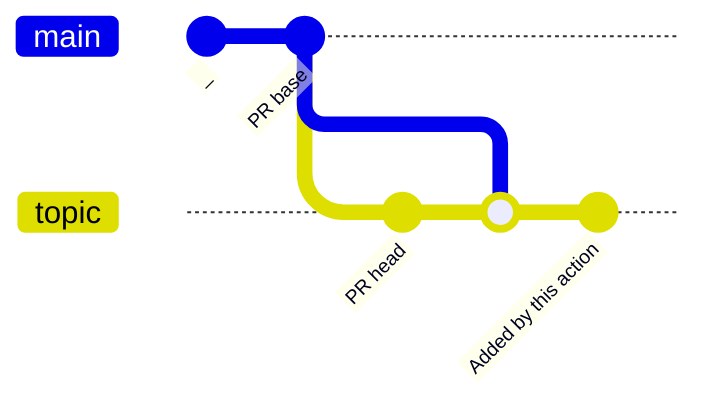
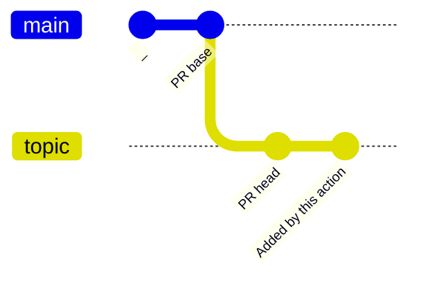

# update-generated-files-action [](https://github.com/int128/update-generated-files-action/actions/workflows/ts.yaml)

This is a general-purpose action to keep consistency of the generated files.

Here are example use-cases.

- Code formatter
  - Prettier
  - gofmt
- Code generator
  - OpenAPI Generator
  - GraphQL Code Generator
  - gRPC
  - SQL


## Getting Started

Here is an example workflow.

```yaml
on:
  push:
    branches:
      - main
  pull_request:

jobs:
  generate:
    runs-on: ubuntu-latest
    steps:
      - uses: actions/checkout@v3

      # something to generate files
      - run: yarn format

      - uses: int128/update-generated-files-action@v2
```

### For pull request event

This action adds a commit of the current change to the head branch, if `git status` returns any change.

Since `actions/checkout` checks out [the merge branch](https://docs.github.com/en/actions/using-workflows/events-that-trigger-workflows#pull_request) by default, this action adds a commit onto the merge commit.
You will see both merge commit and generated commit, for example,


Here is a diagram of the commit graph.



If you don't want to add the merge commit, set the head branch to `actions/checkout` as follows:

```yaml
jobs:
  generate:
    runs-on: ubuntu-latest
    steps:
      - uses: actions/checkout@v3
        with:
          ref: ${{ github.head_ref }}

      # something to generate files
      - run: yarn format

      - uses: int128/update-generated-files-action@v2
```

Here is a diagram of the commit graph if the head branch is checked out.



### For push or other events

This action creates a pull request with the current change, if `git status` returns any change.

Here is an example of created pull request.


You can change the title or body of pull request.

```yaml
      - uses: int128/update-generated-files-action@v2
        with:
          title: Regenerate yarn.lock
```

### Trigger GitHub Actions for new commit

This action uses `GITHUB_TOKEN` by default, but [it does not trigger a workflow](https://docs.github.com/en/actions/using-workflows/triggering-a-workflow#triggering-a-workflow-from-a-workflow) for the new commit.

To re-trigger GitHub Actions for the new commit, you need to specify a personal access token or GitHub App token.

```yaml
      # something to generate files
      - run: yarn format

      - uses: int128/update-generated-files-action@v2
        with:
          token: ${{ secrets.YOUR_PERSONAL_ACCESS_TOKEN }}
```


## Working with Renovate

You can update both dependencies and generated files as follows:

1. Renovate creates a pull request to update a dependency
1. GitHub Actions triggers a workflow
1. This action pushes a change if it exists

If the generated files are inconsistent, automerge will be prevented due to the failure of this action.


## Specification

If `git status` returns any change, this action fails.

### Inputs

| Name | Default | Description
|------|----------|------------
| `title` | see action.yaml | Title of pull request
| `body` | see action.yaml | Body of pull request
| `token` | `github.token` | GitHub token
